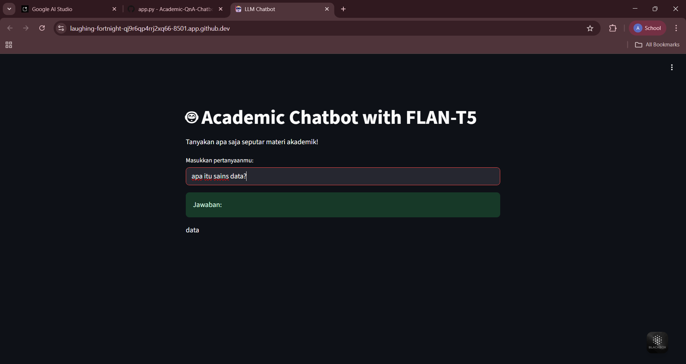

# 🎓 Academic QnA Chatbot
Proyek chatbot berbasis Large Language Model (Google FLAN-T5) menggunakan Hugging Face Transformers dan Streamlit. Chatbot ini mampu menjawab pertanyaan akademik secara interaktif dengan jawaban yang dihasilkan langsung oleh LLM, bukan rule-based.

---

🛠️ Tech Stack
- Python
- Hugging Face Transformers
- Streamlit

📷 Output


## 🚀 Cara Menjalankan
1. Clone repository:
   ```bash
   git clone https://github.com/username/academic-chatbot.git
   cd academic-chatbot

Note : Chatbot belum spesifik banget ke materi akademik, masih pakai model umum